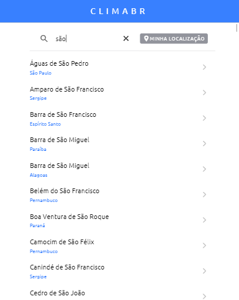
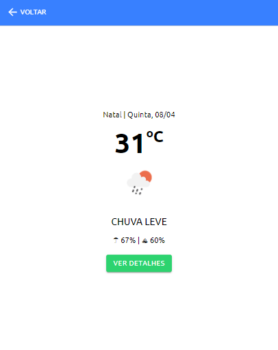
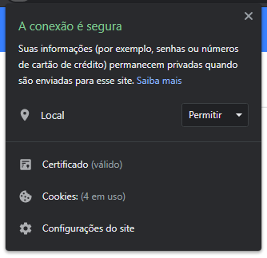
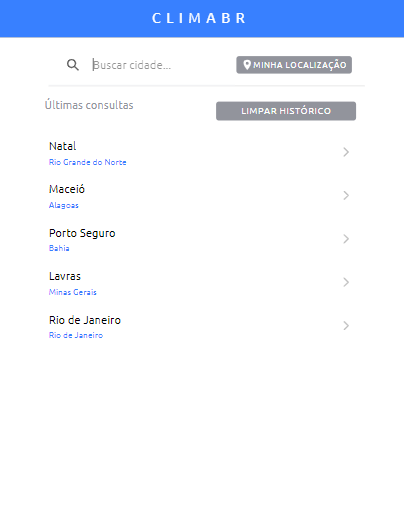

# ClimaBR

Uma aplicação simples para consulta à previsão do tempo de cidades brasileiras.
[Acesse aqui](https://climabr-trabalho.web.app/home)

# Como usar?

Clone este repositório.

Entre na pasta do projeto e execute o comando abaixo para instalar as dependências:

`npm install`

Acesse o site https://openweathermap.org/api, faça seu cadastro e crie uma chave de API.

Crie um arquivo chamado `api-config.ts` no diretório `src/environment` do projeto, contendo o conteúdo abaixo (não se esqueça de alterar a propriedade `api_key` para a sua chave de API):

```ts
export const OPEN_WEATHER_CONFIG = {
  api_key: '<your-api-key>',
  api_url: 'https://api.openweathermap.org/data/2.5/onecall',
  api_icon_url: 'http://openweathermap.org/img/wn',
};
```

Para abrir a aplicação, execute o comando:

`ionic serve`

Enjoy!

# Funcionalidades

## Pesquisa por cidades

Digite pelo menos 3 letras e a aplicação irá buscar essas em uma lista de cidades brasileiras. Para acessar a previsão do tempo, clique na setinha no lado direito. 



Na previsão do tempo, para mais informações, clique no botão Ver Detalhes.



## Pesquisa pela localização atual

Clique no botão de "Minha localização" para consultar a previsão do tempo para sua localização. Para essa funcionalidade é necessário permitir o acesso da aplicação a sua localização.



## Histórico de cidades consultadas

O aplicativo guarda um histórico das cidades que já foram consultadas pelo usuário na aplicação. Ele aparece quando não há uma lista de cidades retornada pela pesquisa.


